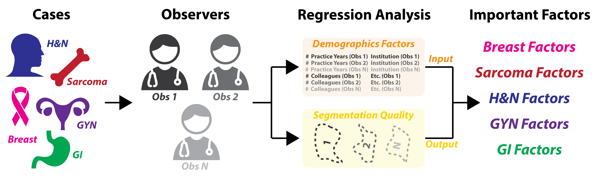

# Determining The Role Of Radiation Oncologist Demographic Factors On Segmentation Quality: Insights From A Crowd-Sourced Challenge Using Bayesian Estimation 

## Repo for code related to C3RO demographics analysis project. 
Pre-print available at: TBD. Corresponding image sets used for this project are avaliable on Figshare (data doi: 10.6084/m9.figshare.21074182). Data descriptor located at: https://www.medrxiv.org/content/10.1101/2022.10.05.22280672v1. All data has been anonymized to remove patient PHI. The CSV files generated as data for this specific project can also be found on Figshare (doi:10.6084/m9.figshare.24021591)  

### This repo contains the following files:  
Jupyter notebook of scripts to generate CSV files for regression analysis (Base_file_generation.ipynb).  

Jupyter notebook of scripts to perform statstical analysis in apper (Statistical_analysis_code.ipynb).  

Folders for various output files (bambi_binary_bayesian_regression_outputs, csv_files, descriptive_stats, plot_outputs).  

### Utilized the following core Python (version 3.8.8) libraries in project:  

arviz version 0.15.1.  
bambi version 0.12.0.  
pymc version 5.6.1.  
SimpleITK version 2.1.1.  
Numpy version 1.24.4.  
Pandas version 1.4.2.  
Surface-Distance-Based-Measures version 0.1.  
Matplotlib version 3.3.4. 
Seaborn version 0.11.2.  

### Collaboration between Fuller lab at MDA and Gillespie lab at MSK. For more information on the Fuller lab and associated projects please visit: https://www.mdanderson.org/research/departments-labs-institutes/labs/fuller-laboratory.html. 
